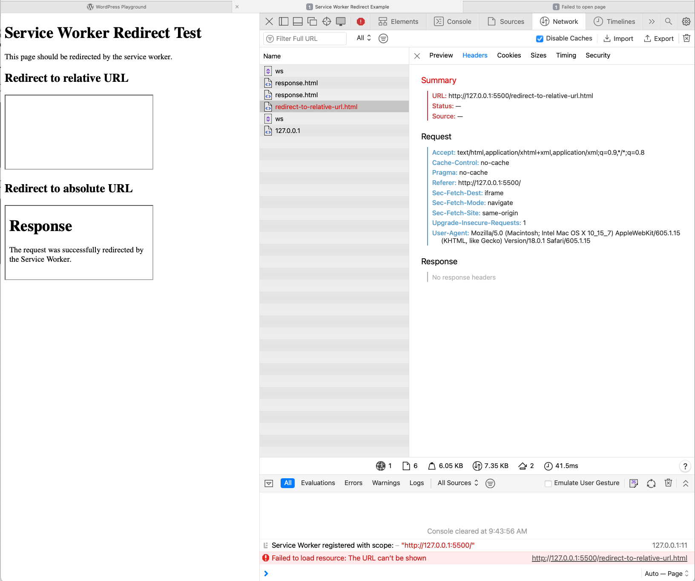

# Service Worker iframe redirect test

This is a test to see if the Service Worker can redirect requests inside iframes.

## Test

The test in `index.html` loads two iframes which should be redirected by the Service Worker to `response.html`.
The first iframe will attempt to redirect to a relative URL and the second one to an absolute URL.
The expected result is that both iframes are redirected to `response.html`.


## Test results

| Browser | Redirect to absolute URL | Redirect to relative URL |
| ------- | ---------------------- | ---------------------- |
| Chrome  | ✓                      | ✓                      |
| Firefox | ✓                      | ✓                      |
| Safari  | ✓                      | ✗                      |


### Safari relative URLs are not redirected

In Safari the relative URL iframe is not redirected, while it works in Chrome and Firefox.

#### Browser console

The browser console shows the following error:
```
Failed to load resource: The URL can’t be shown /redirect-to-relative-url.html
```

#### Service Worker console

The Service Worker console doesn't show any errors.

I was able to confirm that the Service Worker code runs using a debugger.

#### Network tab

The Network tab lists the request to `/redirect-to-relative-url.html` and shows an error.




## How to run

1. Checkout the repo
2. Start a local server
3. Open the page in a browser

### Start a local server

Here are two options to start a local server, but you can use any other static file server.

#### Using PHP
```
php -S 127.0.0.1:8888
```

#### Using Docker
```
docker run -p 8888:80 -v "$(pwd)/":/usr/share/nginx/html nginx
```

